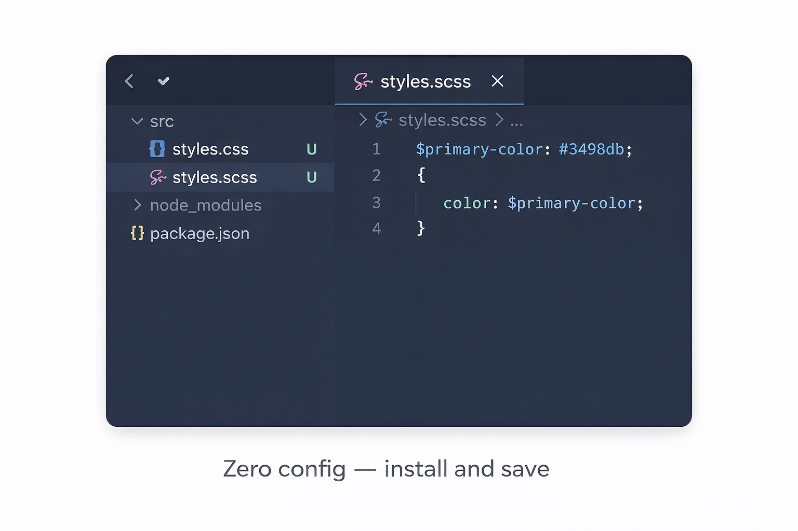
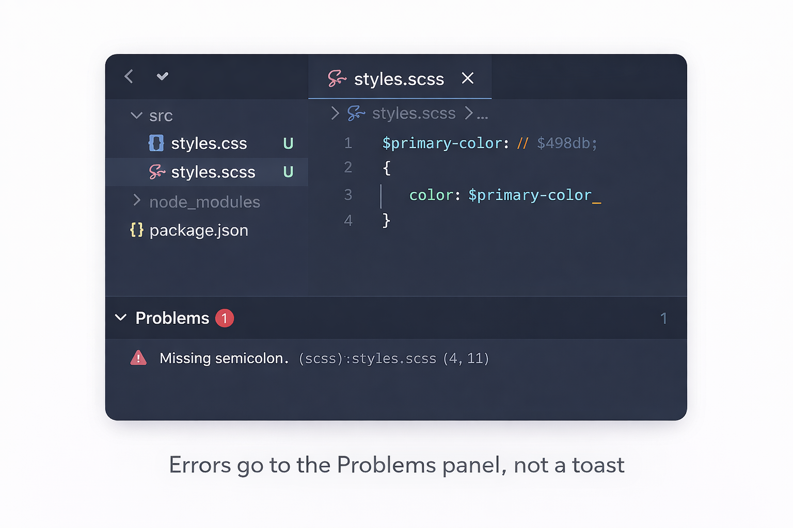
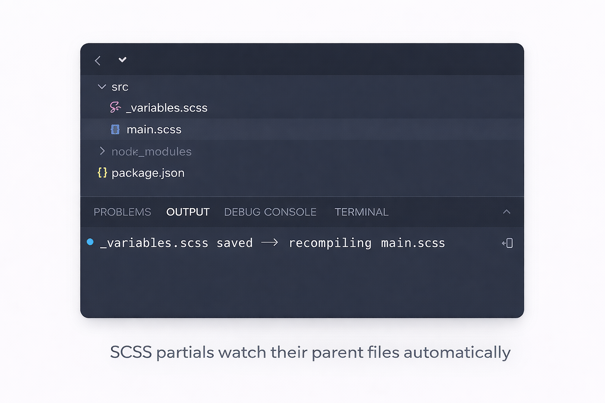

# SaveFlow — Compile on Save (SCSS, Less, TypeScript)

[](https://marketplace.visualstudio.com/items?itemName=GingerTurtle.saveflow)
[](https://marketplace.visualstudio.com/items?itemName=GingerTurtle.saveflow)
[](./LICENSE)

**The maintained replacement for Compile Hero. Install and save — that's it.**

SCSS partials watch correctly. `tsconfig.json` is honoured. Zero CPU on idle. Errors go to the Problems panel, not toast notifications.

---

## Screenshots







---

## Why SaveFlow?

[Compile Hero](https://marketplace.visualstudio.com/items?itemName=Wscats.compile-hero) has 216,000 installs and was the go-to compile-on-save extension — until it was abandoned in 2021 with four critical bugs still open:

| Bug | Compile Hero | SaveFlow |
|---|---|---|
| **SCSS partials don't trigger parent recompile** — the #1 requested feature | ❌ Never fixed | ✅ Full import graph |
| **CPU spikes to 100%** on large projects — caused by `*` activation event | ❌ Never fixed | ✅ Lazy `onLanguage:` activation |
| **tsconfig.json ignored** — TypeScript output ignores your project settings | ❌ Never fixed | ✅ Fully honoured |
| **Toast spam** on every compile error instead of the Problems panel | ❌ Never fixed | ✅ Inline diagnostics |

---

## Quick Start

1. **Install** — search "SaveFlow" in VS Code Extensions or click **Install** above
2. **Open** an SCSS, Less, or Stylus file
3. **Save** — the compiled CSS appears alongside the source file

No tasks. No terminal. No config required.

```scss
// styles.scss
$primary: #1E3A5F;
body { background: $primary; }
```

**Save →** `styles.css` is created instantly:

```css
body { background: #1E3A5F; }
```

---

## SCSS Partial Watch

The feature Compile Hero never shipped — and the #1 reason users needed something better.

When you save `_variables.scss`, SaveFlow traces the full import graph and recompiles every root file that depends on it:

```
_variables.scss  ←  you save this
      ↓
_mixins.scss     (imports _variables)
      ↓
main.scss        ✅ automatically recompiled
```

Works with `@use`, `@forward`, and `@import`. Deeply nested chains included.

---

## Features

### Free — SCSS · Less · Stylus

- ✅ Compile on save — zero config
- ✅ SCSS partial watch with full import graph
- ✅ Per-language output directories
- ✅ Per-language minify toggle
- ✅ SCSS source maps
- ✅ Inline error diagnostics (Problems panel)
- ✅ Ignore glob patterns
- ✅ Zero CPU on idle — lazy activation

### Pro — adds TypeScript · [£4.99/yr](https://gingerturtle.lemonsqueezy.com/checkout/buy/97267f1f-0dd6-4d84-8dcc-43e587030340) · [£14.99 lifetime](https://gingerturtle.lemonsqueezy.com/checkout/buy/39df352c-cc94-4b58-89de-5323df261f6f)

- ✅ TypeScript compile on save — fully honours `tsconfig.json`
- ✅ TSX support
- ✅ Source maps (`.js.map`)
- ✅ Visual settings UI — no JSON editing required

---

## Migrating from Compile Hero

| Compile Hero setting | SaveFlow equivalent |
|---|---|
| `compile-hero.scss-output-directory` | `saveflow.scss.outputDirectory` |
| `compile-hero.less-output-directory` | `saveflow.less.outputDirectory` |
| `compile-hero.stylus-output-directory` | `saveflow.stylus.outputDirectory` |
| `compile-hero.javascript-output-directory` | `saveflow.typescript.outputDirectory` *(Pro)* |
| `compile-hero.ignore` | `saveflow.ignore` |
| `compile-hero.disable-compile-files-on-did-save-code` | `saveflow.<language>.enabled: false` |

---

## Configuration

SaveFlow works out of the box with zero config. All settings are optional.

| Setting | Default | Description |
|---|---|---|
| `saveflow.scss.enabled` | `true` | Enable SCSS/Sass compile on save |
| `saveflow.scss.outputDirectory` | `""` | Output directory. Empty = same folder as source |
| `saveflow.scss.minify` | `false` | Minify CSS output |
| `saveflow.scss.sourceMaps` | `false` | Generate `.css.map` files |
| `saveflow.less.enabled` | `true` | Enable Less compile on save |
| `saveflow.less.outputDirectory` | `""` | Output directory |
| `saveflow.less.minify` | `false` | Minify CSS output |
| `saveflow.stylus.enabled` | `true` | Enable Stylus compile on save |
| `saveflow.stylus.outputDirectory` | `""` | Output directory |
| `saveflow.stylus.minify` | `false` | Minify CSS output |
| `saveflow.typescript.enabled` | `false` | Enable TypeScript *(Pro)* |
| `saveflow.typescript.outputDirectory` | `""` | JS output dir — falls back to tsconfig `outDir` *(Pro)* |
| `saveflow.typescript.sourceMaps` | `false` | Generate `.js.map` *(Pro)* |
| `saveflow.ignore` | `[]` | Glob patterns to skip — e.g. `["**/node_modules/**"]` |

---

## Commands

| Command | Description |
|---|---|
| `SaveFlow: Compile Current File` | Manually compile the active file |
| `SaveFlow: Show Output` | Open the SaveFlow output channel |
| `SaveFlow: Activate Pro` | Enter your Pro licence key |
| `SaveFlow: Deactivate Pro` | Release your licence for use on another machine |
| `SaveFlow: Open Settings` | Open the visual settings panel *(Pro)* |

---

## How It Works

**Silent on success.** When a file compiles without errors, nothing happens. No notification, no status bar flash. Silence is the signal that everything worked.

**Loud on failure.** When compilation fails, the error appears inline in the **Problems panel** with the exact file, line, and column — the same UX as ESLint or TypeScript's own type checker.

**Zero CPU on idle.** SaveFlow activates only when you open a supported file (`onLanguage:scss` etc). It never scans your workspace on startup. Compile Hero's `*` activation was why it pegged your CPU just by opening a large project — SaveFlow doesn't do that.

---

## FAQ

**Does SaveFlow replace my build tool?**
No. It's for development feedback loops. Keep Vite/webpack/esbuild for production builds. SaveFlow gives you instant output as you work.

**Why is TypeScript a Pro feature?**
SCSS, Less, and Stylus are free so the core audience gets full value at zero cost. TypeScript is the most popular use case — gating it behind Pro funds ongoing development.

**Can I use this with Sass indented syntax?**
Yes. Both `.scss` and `.sass` are supported via Dart Sass.

**How do I disable compilation for specific files?**
Add glob patterns to `saveflow.ignore`:
```json
{ "saveflow.ignore": ["**/node_modules/**", "**/*.spec.scss"] }
```

---

## Support

- **Bugs** → [GitHub Issues](https://github.com/Goldenvikingsunset/saveflow/issues)
- **Feature requests** → [GitHub Discussions](https://github.com/Goldenvikingsunset/saveflow/discussions)
- **Pro licence support** → support@gingerturtleapps.com

---

Built by [Ginger Turtle](https://gingerturtleapps.com) · [MIT Licence](./LICENSE)
